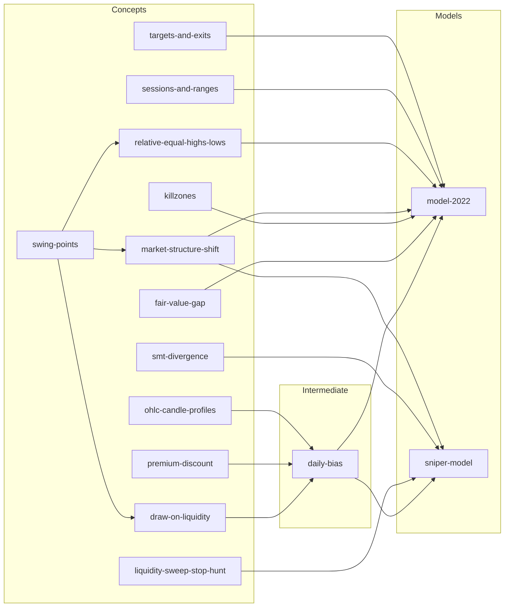

# ICT Trading Research

Futures trading research project implementing ICT (Inner Circle Trader) concepts on ES, NQ, and YM continuous contracts.

## What's in here

| Layer | Location | Purpose |
|---|---|---|
| **Knowledge base** | `knowledge/ict/` | One markdown file per ICT concept with YAML frontmatter — the semantic layer |
| **Package** | `src/ict/` | Installable Python package: data loader, concept detectors, trading models |
| **Backtests** | `backtests/` | Runner scripts; outputs land in `results/` (gitignored) |
| **Strategy notes** | `strategies/notes/` | Human write-ups extracted from video/PDF sources |
| **Data** | `Data/` | 1m continuous contracts for ES, NQ, YM (~1.1 GB, gitignored) |

## Setup

```bash
pip install -e .
```

Data files are not in the repo. Run the acquisition pipeline in `Data/prep/` with a Databento API key.

## Quick start

```python
from ict import DataLoader

loader = DataLoader(timeframe='5T', weeks=52, data_dir='Data')
nq = loader.read_NQ()   # returns DataFrame with DatetimeIndex
es = loader.read_ES()
ym = loader.read_YM()
```

Timeframes: `'1T'` `'5T'` `'15T'` `'1H'` `'4H'` `'D'`

## Running a backtest

```bash
python backtests/fvg_sweep_backtest.py
# → results/fvg_sweep_<date>.html  (interactive Plotly report)
```

## Knowledge base

`knowledge/ict/` is a semantic layer — one file per concept, machine-parseable YAML frontmatter, Detection Rules sections that are the spec for code implementations. Concept slugs are bound to detector code via the `@concept("<slug>")` decorator in `src/ict/registry.py`.

Currently implemented detectors: `swing-points`, `fair-value-gap`, `daily-bias`, `model-2022`.

See [knowledge/ict/README.md](knowledge/ict/README.md) for the full concept index.

## Models

| Model | File | Status |
|---|---|---|
| ICT 2022 (FVG sweep) | `src/ict/models/ict/model_2022.py` | backtested |
| Sniper Model | `src/ict/models/ict/sniper_model.py` | implemented |
| Silver Bullet | `knowledge/ict/models/silver-bullet.md` | spec only |
| Unicorn | `knowledge/ict/models/unicorn.md` | spec only |
| Three Indians / Wolfe Wave | `knowledge/ict/models/three-indians.md` | spec only |

## Concept Lineage

How concepts compose into models. Re-generate after adding new concepts:

```bash
python scripts/lineage.py                  # print full diagram
python scripts/lineage.py model-2022       # single model's graph
python scripts/lineage.py --update-readme  # regenerate the section below
```

<!-- lineage-start -->

<!-- lineage-end -->

## Disclaimer

For educational and research purposes only. Trading involves substantial risk of loss.
