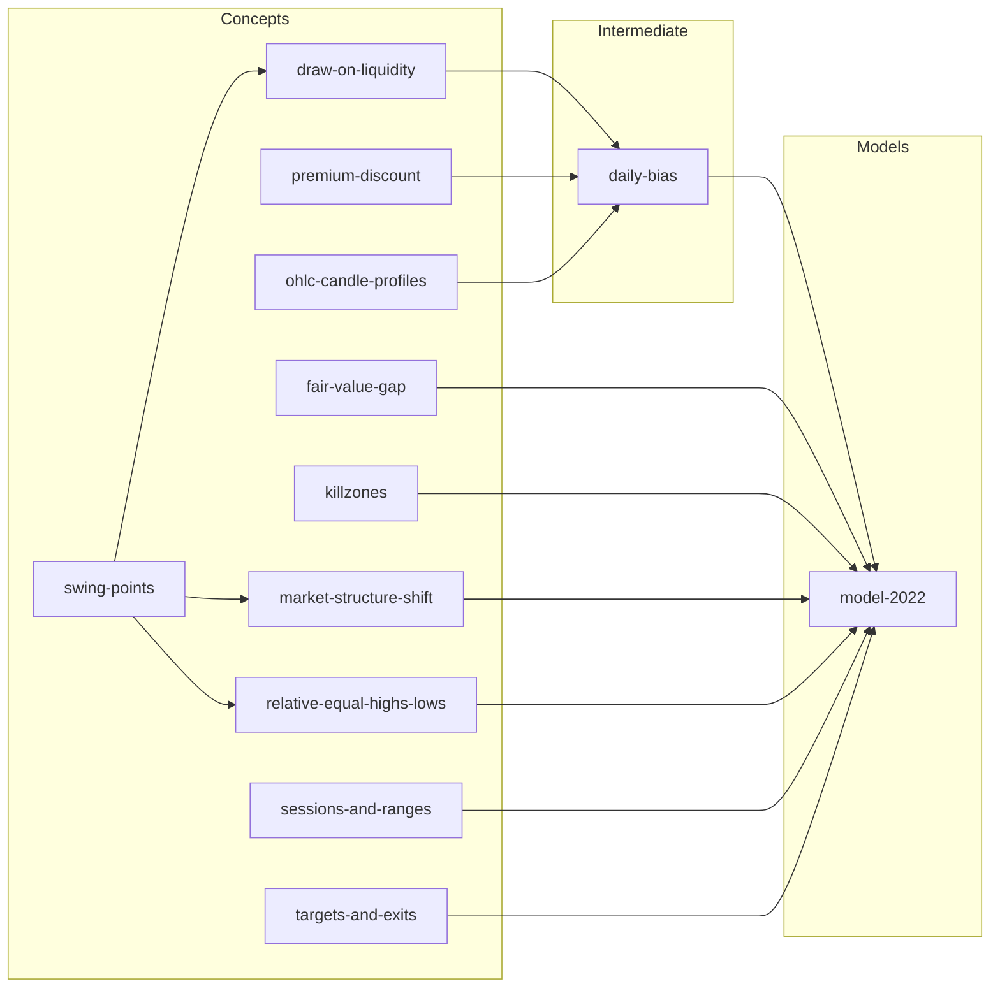

```mermaid
flowchart LR
    subgraph Concepts
        draw_on_liquidity["draw-on-liquidity"]
        fair_value_gap["fair-value-gap"]
        killzones["killzones"]
        market_structure_shift["market-structure-shift"]
        ohlc_candle_profiles["ohlc-candle-profiles"]
        premium_discount["premium-discount"]
        relative_equal_highs_lows["relative-equal-highs-lows"]
        sessions_and_ranges["sessions-and-ranges"]
        swing_points["swing-points"]
        targets_and_exits["targets-and-exits"]
    end
    subgraph Intermediate
        daily_bias["daily-bias"]
    end
    subgraph Models
        model_2022["model-2022"]
    end

    draw_on_liquidity --> daily_bias
    premium_discount --> daily_bias
    ohlc_candle_profiles --> daily_bias
    swing_points --> draw_on_liquidity
    swing_points --> market_structure_shift
    daily_bias --> model_2022
    fair_value_gap --> model_2022
    killzones --> model_2022
    market_structure_shift --> model_2022
    relative_equal_highs_lows --> model_2022
    sessions_and_ranges --> model_2022
    targets_and_exits --> model_2022
    swing_points --> relative_equal_highs_lows
```