# ICT Forex Notes — Reginald Mmari (January 2020)

> **Source**: `inner-circle-trader-ict-forex-ict-notes.pdf` (109 pp., compiled by Reginald Mmari from ICT's
> pre-2020 forex teachings). Converted to markdown with the original chart figures extracted to
> [assets/ict-forex-notes/](assets/ict-forex-notes/) (named `pNNN-x.png` after the printed page they came from).
>
> **Context warnings for our futures workflow**:
> - All session times in this document are **GMT, forex-market context** (2020-era ICT). Our canonical killzones
>   for index futures live in [knowledge/ict/time-and-price/killzones.md](../../knowledge/ict/time-and-price/killzones.md)
>   and are defined in New York time.
> - Pip-based risk numbers (20–30 pip stops, 50-pip Asian range, etc.) are forex-calibrated and do not transfer
>   1:1 to ES/NQ/YM points.
> - This is early-era ICT vocabulary: "market flow" ≈ short-term order flow, "trader's trinity" and pivots/EMAs
>   were later dropped from his teaching; treat them as historical.

---

## 1. Price Foundation — Swing Points (Fractals)

- **Swing high**: ideal setup is two lower candles on the left and right with a higher candle in the middle.
- **Swing low**: ideal setup is two higher candles on the left and right with a lower candle in the middle.

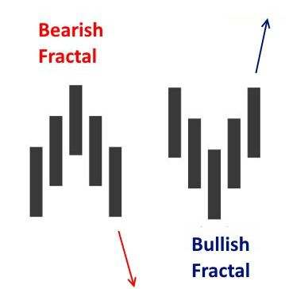

## 2. Market Structure Concept

- Market trades in a generic rhythm: short-term low (STL) → short-term high (STH) → new STL.
- **ITL**: an STL with higher STLs on both sides. **ITH**: an STH with lower STHs on both sides.
- **LTL/LTH**: an ITL/ITH flanked by higher ITLs / lower ITHs.
- "Every swing in price has an equal counter swing it is unfolding from and attempts to fulfill."

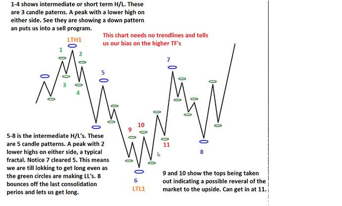

### Trading with market structure

- If bullish, only trade long; filter counter-trend setups. Buy near LTL/ITL/STL with objectives based on the
  larger swing projection; reverse for shorts.
- Market structure breaks after reaching S/R and forming an ITL/ITH; on a break in the opposite direction, look
  for an optimal trade entry (OTE).
- Symmetry: if a swing up moves 50 pips after consolidation, anticipate another 50 pips on continuation, or a
  50-pip decline on failure.
- Bullish structure = breaking previous swing highs while holding swing lows (focus on the lows / buy low);
  bearish = mirror image.
- When bearish structure breaks, structure shifts bullish, and vice versa. Expect breaks at S/R levels.
- Use Daily, H4, H1 nested fractals; wait for HTF structure to be in sync with LTF market flow.
- High probability of big market shifts roughly **quarterly** — combine with COT and dollar-index analysis.
- Cycle count: measure swing-low to swing-low, count the days, multiply by 1.28 (round down), add that many
  bars to the swing high in the middle — projects the next swing high.

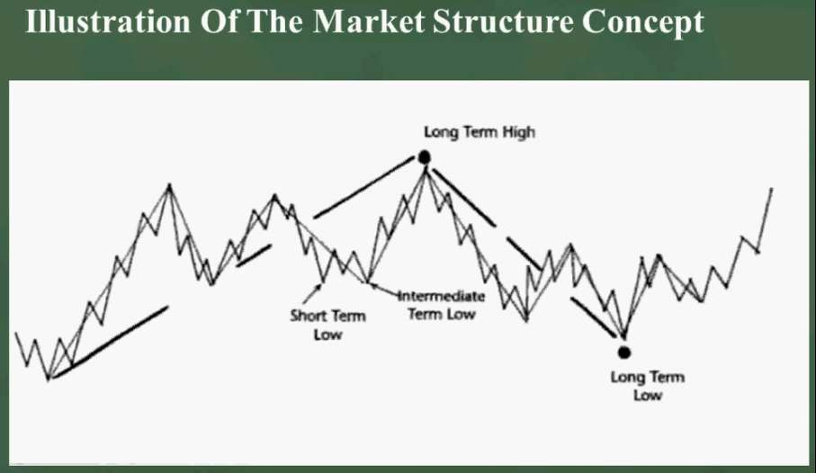

## 3. Market Flow

- Only the **most recent** swing high/low defines market flow; old swings are disregarded.
- Recent swing high broken → flow is bullish until the most recent swing low is broken (and vice versa).
- Strong agreement when Daily, H4, H1 align; use **H4** for consistency.
- If structure and flow are not aligned or unclear: **don't trade**.

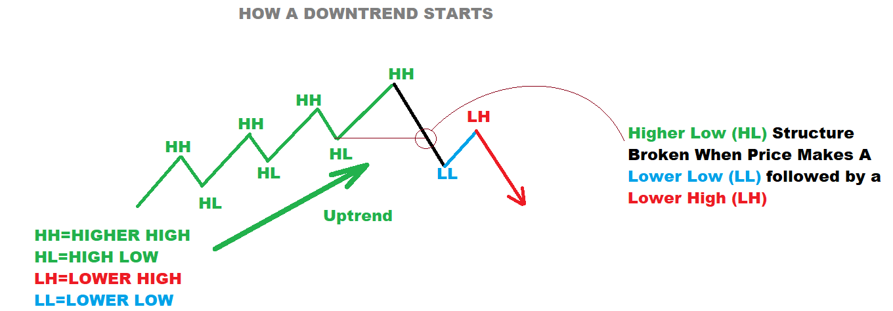
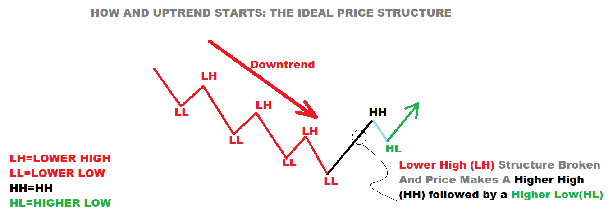

## 4. Support & Resistance

### Natural S/R
12-month, quarterly (best), monthly, weekly, daily highs/lows; session highs/lows; intraday fractals (15m);
trend lines. Once support breaks it acts as resistance (and vice versa).

Session parameters (GMT, forex): Asia 00:00–09:00 sets up London; London 08:00–17:00 sets up NY;
NY 13:00–22:00 sets up the next day. Allow ±1 hour.

### Implied S/R — Fibonacci

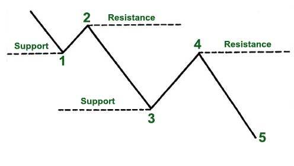

| Level | Description |
|---|---|
| 0 | First TP / scaling |
| 0.62 | 62% — entry zone begins |
| **0.705** | **OTE "sweet spot"** |
| 0.79 | 79% — deep edge of entry zone |
| 0.5 | Equilibrium |
| 1 | 100% |
| −0.27 / −0.62 | TP1 / TP2 |
| −1 | Symmetric swing |
| 2 | 200% |

- Targeting with retracement: pull high→low (or low→high); first TP near the 100 level, then 200.
- Prolonged targeting: set the swing high on the 50 level instead of 100 to project extended objectives.
- Draw fibs off the previous three days' significant swings and session highs/lows, not just daily extremes.

### Other levels
- Week open/close, previous day open/close, daily ADR high/low.
- **Institutional price levels**: 00 / 20 / 50 / 80 figure levels (e.g. 1.6000, 1.5980, 1.5950, 1.5920).
  Watch candle **bodies** at these numbers, not wicks.
- Pivots: price above central pivot → sell zone; below → buy zone. Best in ranging conditions.

### ICT Trader's Trinity
- Mark the high/low of the last 3 periods on any timeframe (3 months / 3 weeks / 3 days).
- Inside the trinity = range-bound; a break of the trinity precedes a major high/low. Project with fib 162/200
  from the break back to the opposite trinity extreme.
- Upper boundary = overbought (look to sell), lower = oversold (look to buy); avoid trading the fair-value
  middle zone without another confirming pattern.

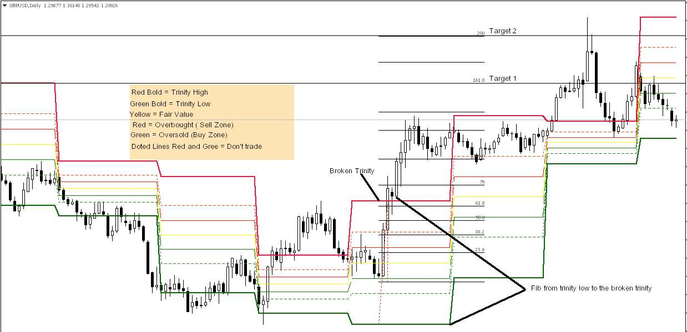

## 5. COT (Commitment of Traders)

- Track **Commercials** (smart money, counter-trend) and Large Speculators; ignore small traders.
- Commercials at a 12-month/4-year extreme net short → expect a significant long-term **high**; extreme net
  long → long-term **low**.
- Above the 50 line = net long, below = net short. A turn that stays on the same side of 50 = position
  offloading before the true move.
- Filter longs at 12-month/4-year extreme commercial net shorts; filter shorts at extreme net longs.
- Pair with seasonal tendencies (USD/EUR/GBP monthly patterns — forex-specific, see source PDF p. 22).

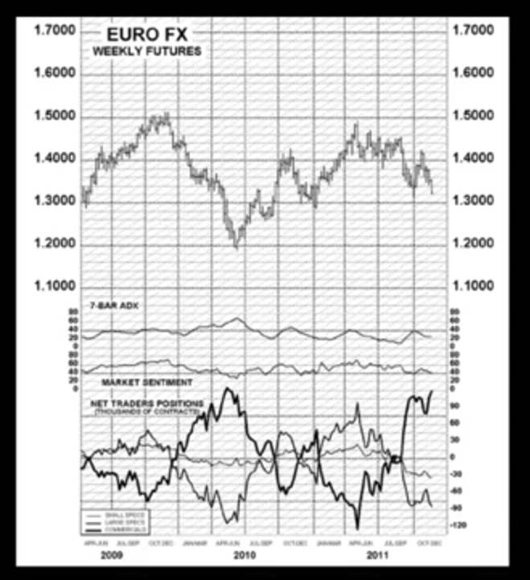
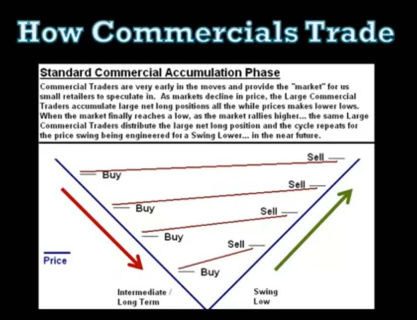
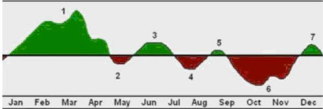

## 6. SMT Divergence (Smart Money Correlation)

- USDX sets market tone: **risk on** = dollar falls (commodities, equities, foreign currencies rise);
  **risk off** = dollar rises.
- **Bullish SMT** (at predetermined support): one correlated pair makes a lower low, the other fails →
  demand in operation → buy the **stronger** pair (the one that failed to go lower).
- **Bearish SMT** (at predetermined resistance): one makes a higher high, the other fails → supply in
  operation → sell the **weaker** pair (the one that failed to go higher).
- Works on stock indices too: compare Dow / S&P 500 / Nasdaq highs at resistance and lows at support.
- CRB commodity index: inverse to USDX, tends to turn early — long-term trend warning.

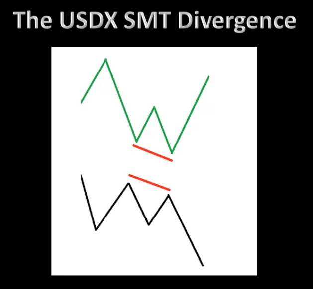
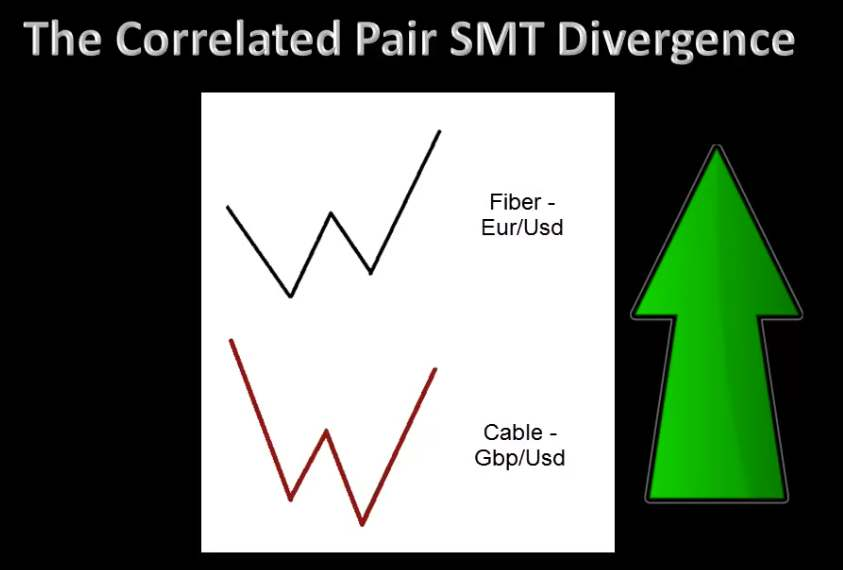
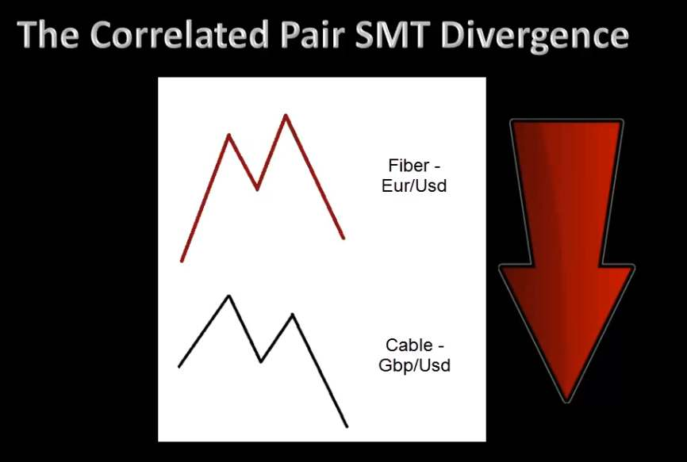

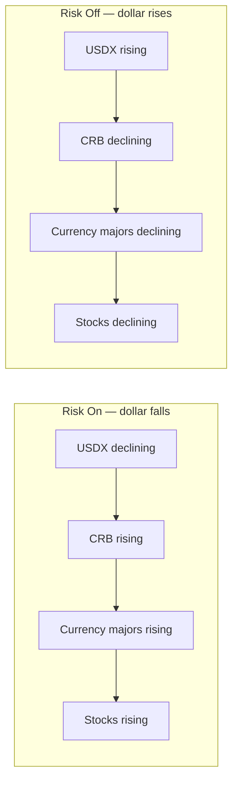
```mermaid
flowchart LR
    subgraph RISK_ON [Risk On — dollar falls]
        A1[USDX declining] --> A2[CRB rising] --> A3[Currency majors rising] --> A4[Stocks rising]
    end
    subgraph RISK_OFF [Risk Off — dollar rises]
        B1[USDX rising] --> B2[CRB declining] --> B3[Currency majors declining] --> B4[Stocks declining]
    end
```

## 7. Reaction Levels (PD Arrays, early vocabulary)

Work top-down: mark Monthly/Weekly/Daily swing points (open, close, high, low of the 3-candle fractal),
annual/quarterly/monthly/weekly/daily highs-lows. Don't hunt intraday patterns unless price is at an HTF
reaction level.

### Order Blocks

- **Bullish OB**: the lowest down-close candle with the most open-to-close range near support.
  Validated when its high is traded through later. Entry on return to the OB high; stop below the OB low
  (or raise to just below 50% of the OB once price runs).
- **Bearish OB**: the highest up-close candle near resistance — mirror rules.
- Plainly: bullish OB = last bearish candle before the move up that breaks a swing high; bearish OB = last
  bullish candle before the move down that breaks a swing low.

**Order block selection rules**
- If an OB is broken, the previous OB behind it becomes the candidate turning point. Keep old OBs marked —
  they get revisited.
- Retracement objectives into a bearish OB: ① OB low, ② OB open, ③ OB midpoint. **More than 50% retracement
  invalidates the OB** — fall back to the previous one.
- After SMT divergence at S/R, the first/lowest OB is rarely repeated; wait for a second OB in the direction
  of the move, and "cut through the candles" to find supporting structure on the left.
- A nearby swing low can turn price before it precisely tags a bearish OB.
- Consolidation near an OB during Asia or NY is a good sign a trade is forming.

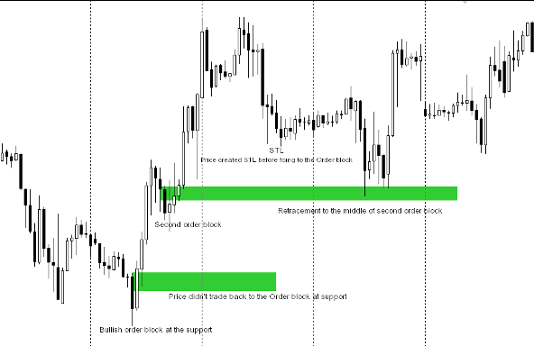
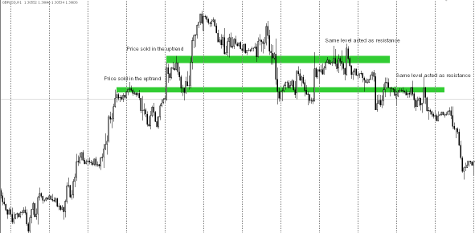

### Liquidity concepts

- **Liquidity pools**: resting stops just above previous highs / below previous lows. First question on opening
  a chart: *"where is the money?"*
  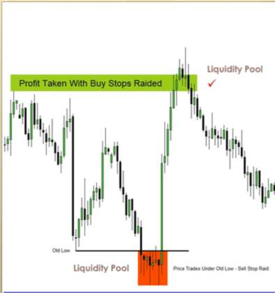
- **Liquidity void**: a one-sided burst move (thin liquidity). Price returns later to fill the void and retest
  the OB at its origin.
  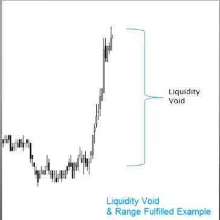
  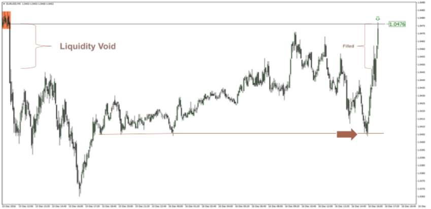
- **Fair value gap**: a price range where only one side of liquidity was offered, typically confirming a
  liquidity void on a lower timeframe; literal price gaps create a vacuum that gets filled.
  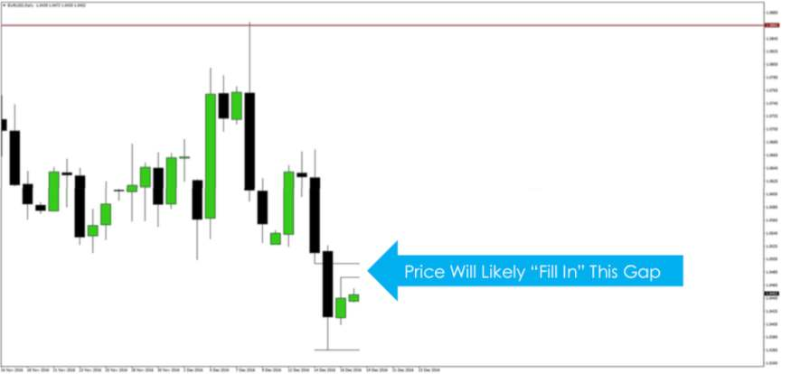
- **Liquidity injection**: the Judas-swing/stop-hunt move that takes stops above a previous swing high or
  below a previous swing low.
  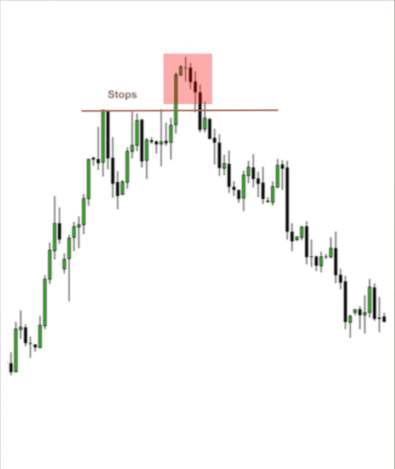
- **Neutralizing open float**: swing high + fast move down + Asian consolidation → expect a raid of the Asian
  high and the prior swing high before the real sell-off (mirror for buys).
  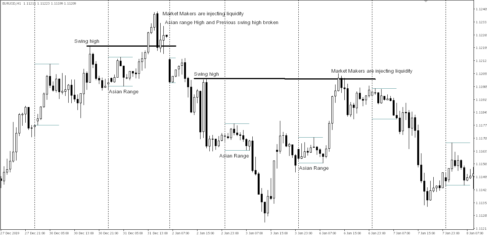
- **Neutralizing pending stops ("seek and destroy")**: both-sides raids that take swing highs *and* lows,
  classic NFP-week pattern, ends consolidating mid-range.
  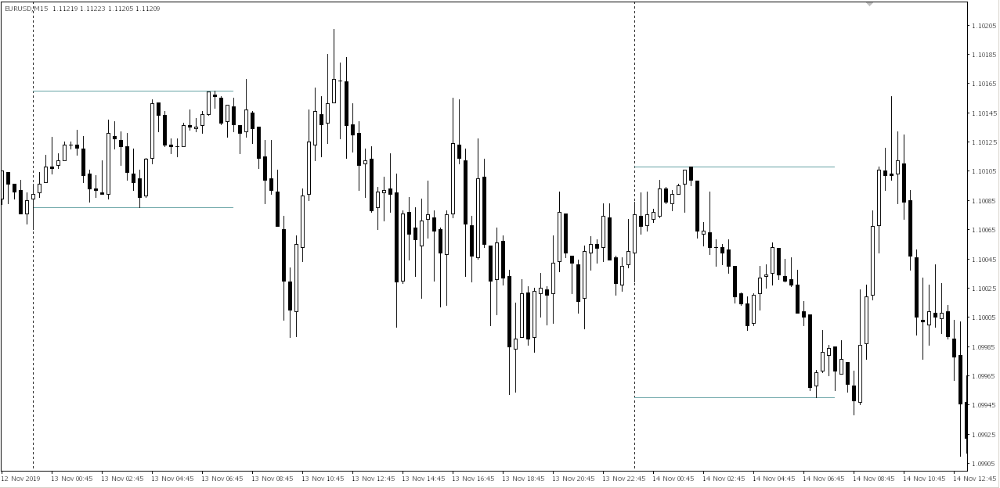
- **Engineering liquidity**: the false move out of the Asian range that validates breakout trades with the
  trend, stops them out in London/NY, then goes the intended way. Double tops/bottoms = stops waiting.
  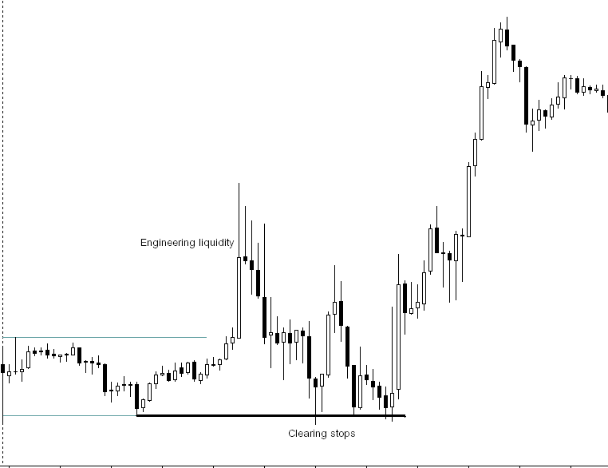
- **Crouching outside order block**: price approaching an HTF order block inside a killzone — one of the
  strongest London open / NY open / London close setups.
  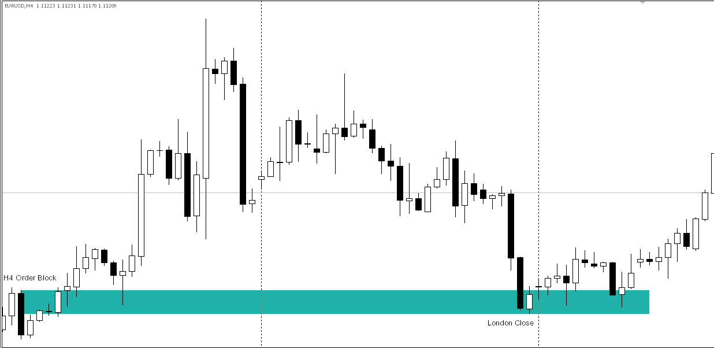
- **Institutional pricing**: figure levels (00/20/50/80 — the notes also list 10/30/60/90 variants) aligned
  with HTF S/R, OBs and fibs confirm direction. Bodies, not wicks.
  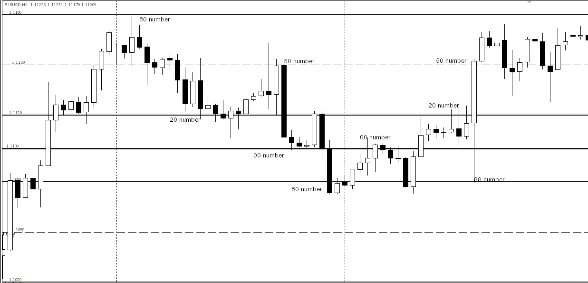

### Mitigation Blocks

- Form at S/R around intermediate/long-term highs and lows when market structure breaks.
- Sell setup: use the last bearish candle (bearish OB) before the move up that took the stops and broke the
  structure low; after the break, wait for price to return to the OB low.

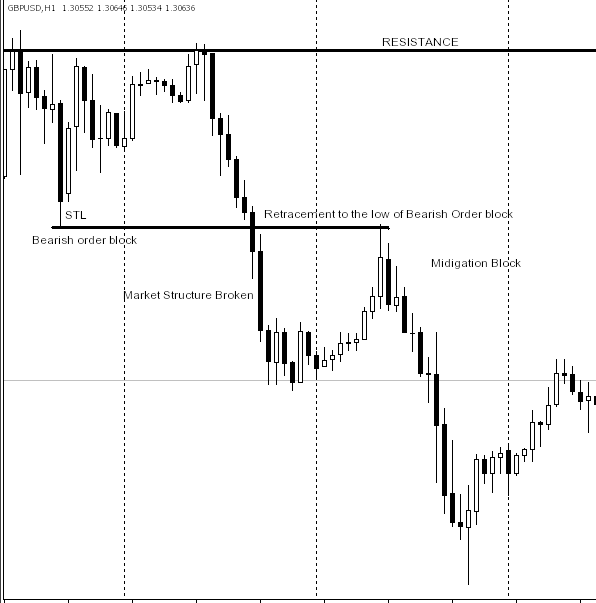

### The Breaker

- Like a mitigation block, tied to the Judas swing: the OB prior to the false move that breaks the Asian range
  against the trend. After the reversal breaks back through, wait for the retrace to that OB.
- The breaker takes the previous swing **high** before it takes support, and the previous swing **low** before
  it takes resistance.
- **Bullish breaker**: up-close candle in the most recent swing high prior to an old low being violated —
  trapped sellers mitigate when price returns to it (buy setup).
- **Bearish breaker**: down-close candle in the most recent swing low prior to an old high being violated
  (sell setup).

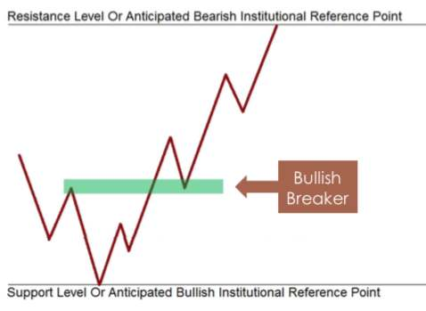 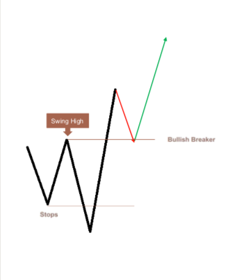
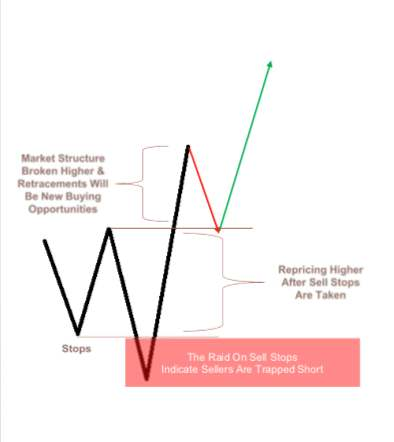 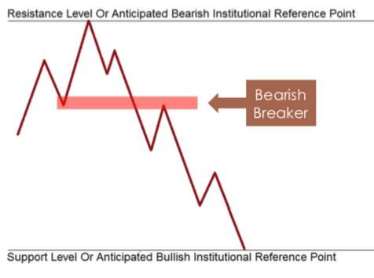

## 8. The Power of Three

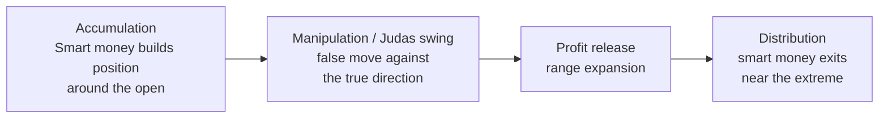
```mermaid
flowchart LR
    A[Accumulation\nSmart money builds position\naround the open] --> B[Manipulation / Judas swing\nfalse move against\nthe true direction] --> C[Profit release\nrange expansion] --> D[Distribution\nsmart money exits\nnear the extreme]
```

- Smart money **accumulates below the open** (up days) and **distributes above the open** (down days).
- Up day anatomy: open near the low (~bottom 20% of range), long body, close near the high (~top 20%).
  The dip below the open is the Judas swing — a fast move below the open *confirms* the long idea.
- Down day: mirror image.
- Sequence to watch: opening price → Judas swing/false move → range expansion (real move).
- Preconditions: HTF premise in mind; price at Weekly/Daily/H4 (≥H1) S/R; SMT divergence at the level; use
  time-and-price (killzones); wait for the daily chart to post a fractal.

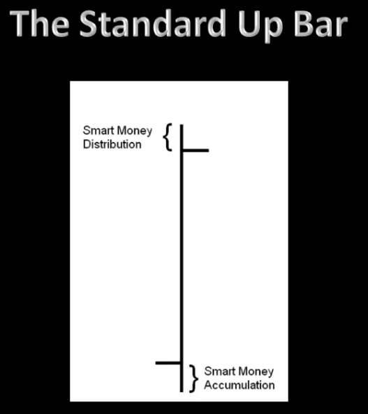
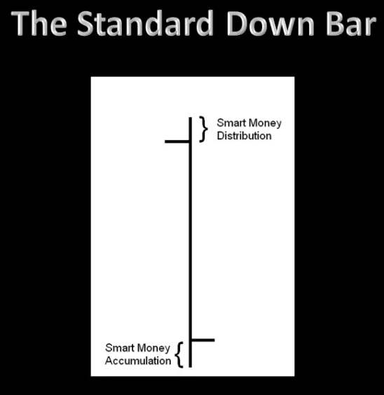

## 9. Time & Price Theory — Killzones (GMT, forex)

| Killzone | GMT window | Notes |
|---|---|---|
| Asian | 23:00 – 03:00 | low volatility; Yen pairs dominate |
| London open | 06:00 – 10:00 (ideal 07:00–09:00) | usually posts the high or low of the day |
| New York open | 12:00 – 15:00 | futures open 12:20; trade in sync with London |
| London close | 15:00 – 18:00 | profit-taking window, reversal profile |

Allow ±1 hour around each (setups come early/late; DST).

- 05:00 GMT = start of the *true trading day* and end of the Asian range; 19:00 GMT = end of the true day.
- 20:00–00:00 GMT = **Central Bank Dealers Range (the "flout")**; 00:00–05:00 GMT = Asian range.
- High/low of the day usually forms in the 4 hours after 05:00 GMT, most often **09:00–09:30 GMT**.
- 10:00 GMT: expect a Judas swing / divergence against the 07:00–09:00 move that sets up the NY OTE; if London
  had no Judas, expect it at 10:00. Mark the 10:00 open.
- Sells: high of day ideally forms 07:00–10:00 GMT, low of day around 15:00–16:00 GMT (close shorts there).
- NY entries from 12:20 GMT: buy ~10 pips below the 12:20 price, sell ~10 pips above it.
- Days: Monday–Wednesday are the high-probability days for the weekly high/low (especially Tue/Wed London open).

## 10. Market Profiles

- **Consolidation range**: equilibrium; establish positions during it; breaks tend to retest the range then go.
- **Breakout (valid/false)**: we don't trade breakouts — wait for the retest.
- **Trending**: don't chase a move already underway; wait for the next consolidation.
- **Reversal**: a bullish Asia/London(/NY) day that fails and reverses lower (or mirror). Typically NY open,
  London close, or late NY posts the reversal.

## 11. ICT Buy & Sell Model (Market Maker Profile)

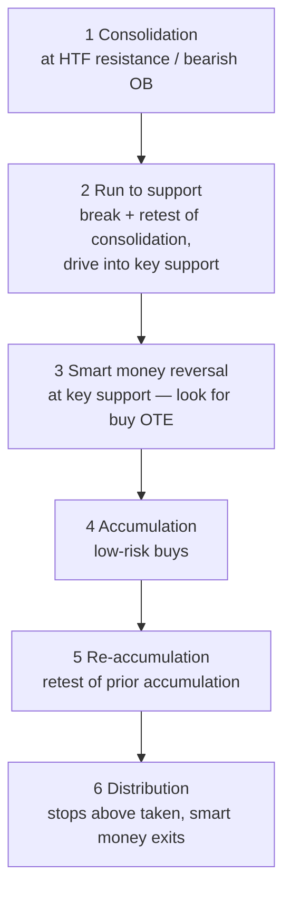
```mermaid
flowchart TD
    C1[1 Consolidation\nat HTF resistance / bearish OB] --> R[2 Run to support\nbreak + retest of consolidation,\ndrive into key support]
    R --> SMR[3 Smart money reversal\nat key support — look for buy OTE]
    SMR --> ACC[4 Accumulation\nlow-risk buys]
    ACC --> REACC[5 Re-accumulation\nretest of prior accumulation]
    REACC --> DIST[6 Distribution\nstops above taken, smart money exits]
```

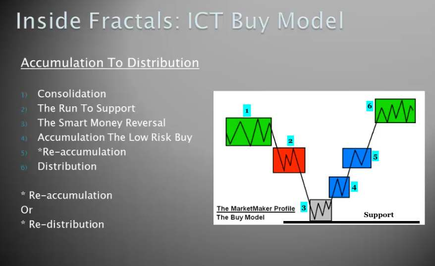

- Pattern is fractal — all timeframes, all instruments. Sell model is the mirror image off key resistance.
- The re-accumulation stage is the tell: HTF-bearish → price respects the *low* of prior accumulation and
  continues down (continuation); HTF-bullish → price trades above prior accumulation, stopping out shorts.
- Pay most attention to stages 1 (consolidation), 3 (smart money reversal) and 6 (distribution).

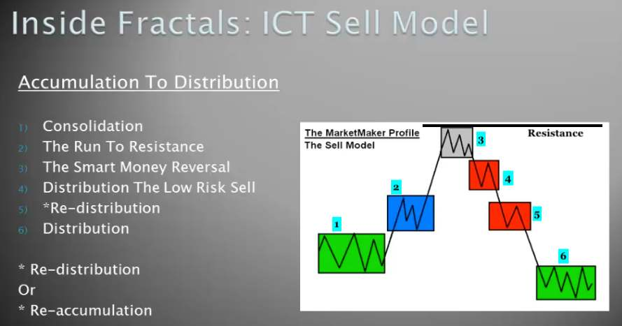

## 12. Multiple Timeframes & Top-Down Analysis

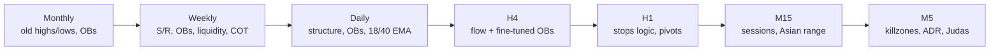
```mermaid
flowchart LR
    MN[Monthly\nold highs/lows, OBs] --> WK[Weekly\nS/R, OBs, liquidity, COT] --> D1[Daily\nstructure, OBs, 18/40 EMA] --> H4[H4\nflow + fine-tuned OBs] --> H1[H1\nstops logic, pivots] --> M15[M15\nsessions, Asian range] --> M5[M5\nkillzones, ADR, Judas]
```

- Frame every trade on at least three timeframes: highest = directional bias, middle = management,
  lowest = entry. Position MN/WK/D1 · Swing D1/H4/H1 · Short-term H4/H1/M15 · Day/scalp H1/M15/M5.
- Stages of analysis: **General market** (risk on/off via USDX, CRB, stocks, COT) → **Anticipatory** (weekly/
  daily levels — where you spend most time) → **Execution** (hunt setups at those levels) → **Management**
  (TP/SL/scaling rules) → **Reactionary** (abort criteria) → **Documentation** (journal).

## 13. Trading Plan Routines

### Intermediate term (>200 pips)
Monthly/Weekly/Daily S/R + risk on/off; wait for price at HTF levels; OTE entry (limits at 62–70.5%);
risk ≤2%; stop ~30 pips; TP1 = 50% off at 20–30 pips, stop to breakeven; scale rest at fib 127/162/200.

### Short term (50–150 pips, intraday to <5 days)
- D1 with **18 & 40 EMAs** (close): 18 above 40 and widening → hunt buys (don't trade crossovers).
  18 EMA acts as dynamic support on D1; expect hidden divergence or OTE there.
- After a D1 fractal forms, enter on the **4th day**. Significant highs form above the EMAs, lows below.

### Intraday (20–100 pips)
Day range is the deciding factor. Buy: wait for the initial low to be breached **below the opening price**
into HTF support within a killzone. Sell: mirror. Entries/exits on time-and-price theory.

### 20-pip scalping method
Key S/R + anticipate Judas → OTE at the level → risk 20 pips → SMT divergence to call the extreme of day →
TP1 at 20 pips (50% off, stop to BE), hold rest for the daily range into NYO/LC/18:00 GMT.

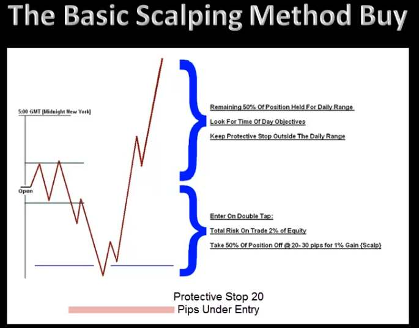
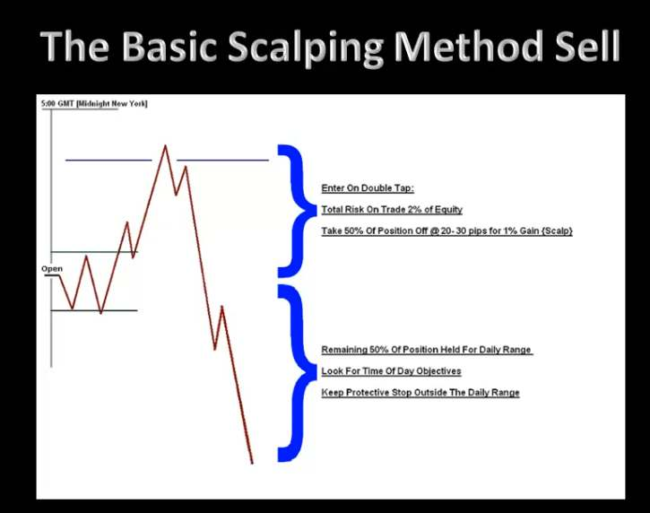

## 14. Session Trading

### Asian session
- Typically trades **counter** to the NY direction (corrective bounce); rarely follows through on new extremes.
- Ideal range ≤50 pips. If wider, look for OTE *inside* the range and expect no Judas outside it.
- OTE buys form when price trades down into HTF support (wait for a ~20-pip bounce first).

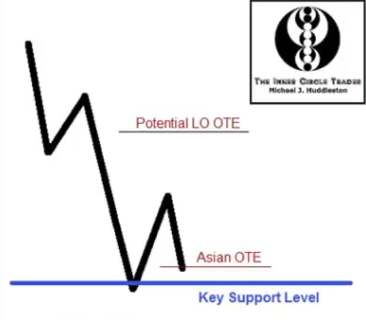 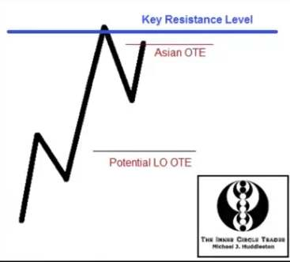

### London open tactic
- Largest range of the day. First objective after London open: **raid Asian-session stops**, then run to the
  HTF level & OTE. "The London Express" = the 4–8 h true move.
- Buy below the 05:00–05:30 price, below the opening price, and below the Asian swing low (sell = mirror).
- Turtle-soup variant: an initial fake-out outside the Asian range *before* the real Judas swing.
- TP on time-and-price: ideal 15:00–16:00 and 18:00 GMT, or when price returns to the Asian range pre-NY.
- Avoid London open on: rate announcements, key speeches, holidays, weekly objective already met, Asian
  range >50 pips (wait for NY).

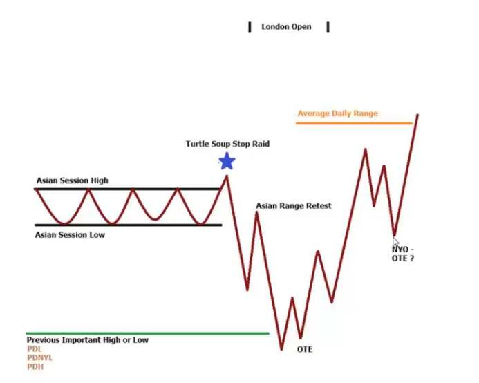
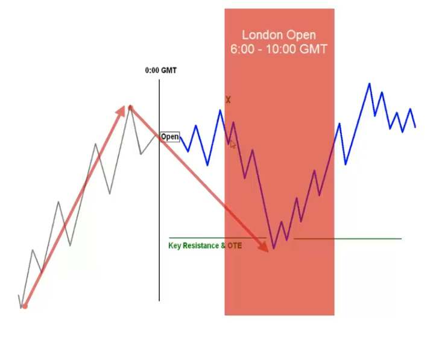
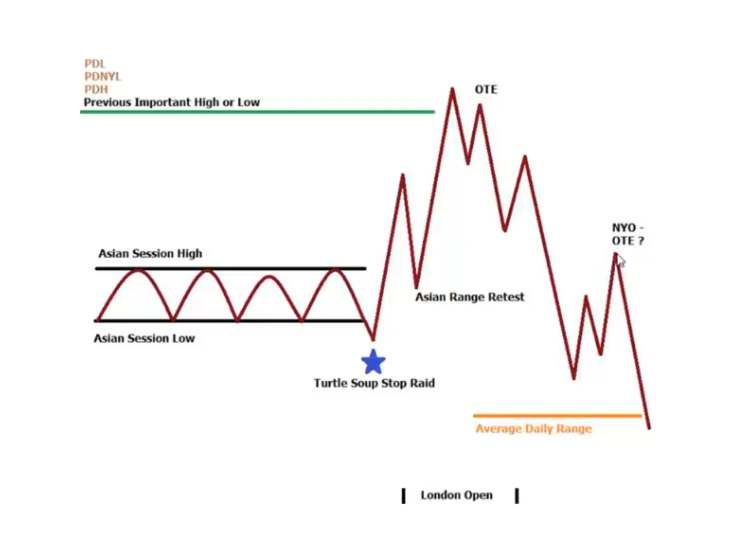

### London close (reversal profile)
- Killzone 15:00–18:00 GMT; profit-taking around 16:00.
- **Counter-trend scalp** (15–20 pips, M5): both USDX and the pair have met 5-day ADR; bounce off a marked
  level; fib the short swing; OTE entry; risk 10 pips beyond the swing.
- **Trend trade** (classic reversal): the day starts as a classic buy day, reverses at London close / late NY
  and trades through the London low (or mirror) — usually at an HTF OTE.

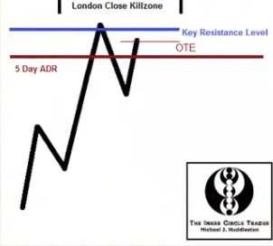
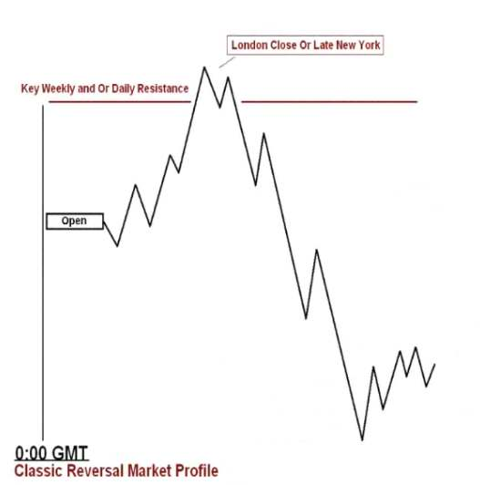
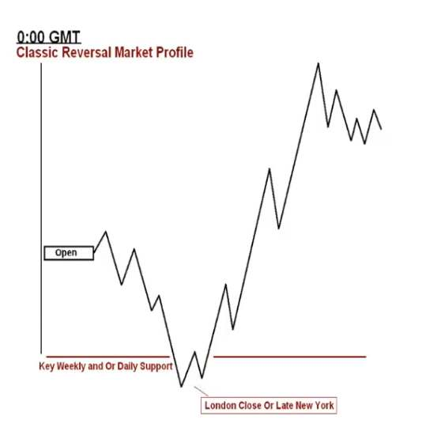

### New York open
- Easiest session — London high/low already in place; majority of the time NY trades in sync with London.
- Expect a pullback to the London-formed high/low (liquidity pool) and to the 05:00–05:30 GMT price.
- Buy below the 10:00 and 12:20 GMT opens; sell above them. Avoid if D1 swings are maturing into key S/R.

## 15. ICT Intraday Price Templates

| Template | Signature | Figure |
|---|---|---|
| Classic buy | Drop below open at the right time into key support; open→support ≈ 15–30 pips, faster = better; TP 20–30 pips at 12:00 | 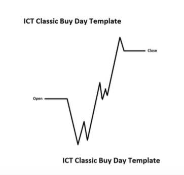 |
| London swing to Z-day | Mid-swing pause day after 2–3 big-move days | 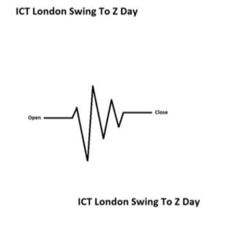 |
| London swing → NYO/LC reversal | Key-reversal day; right shoulder of an HTF H&S or swing into HTF OTE; reversal blows through NY, London and Asian extremes | 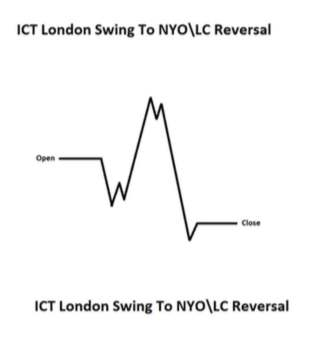 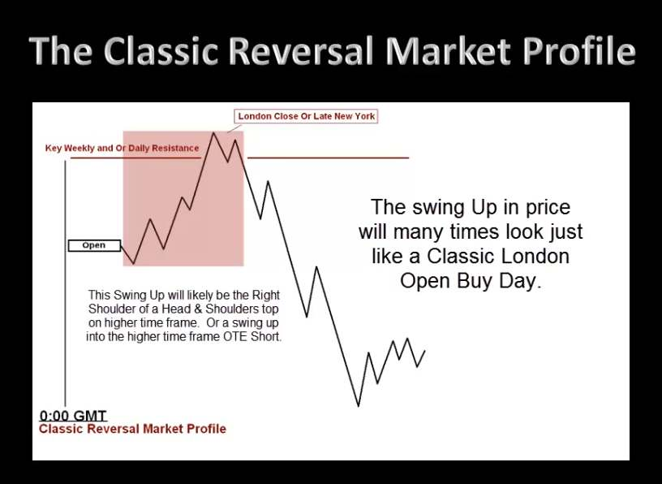 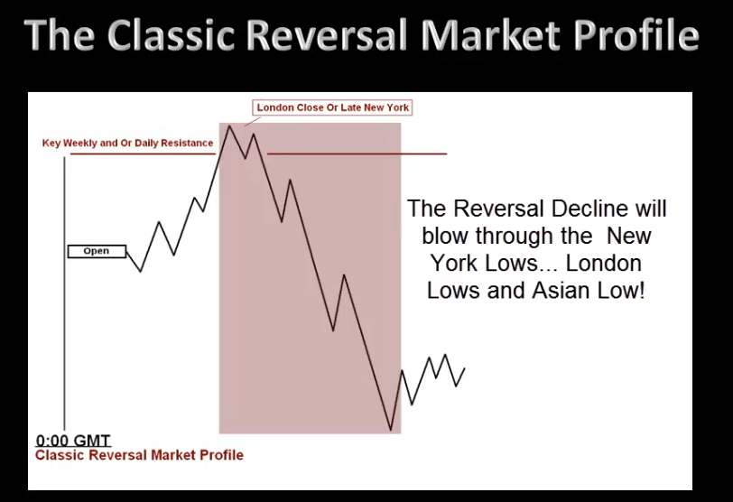 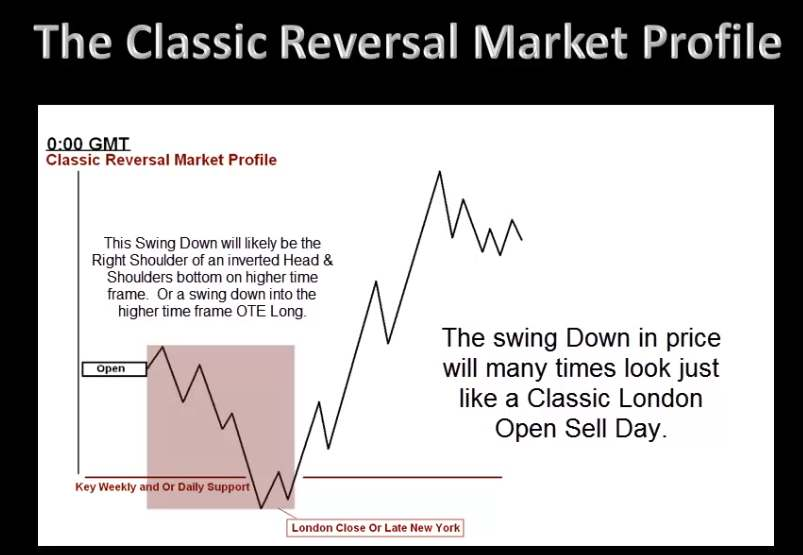 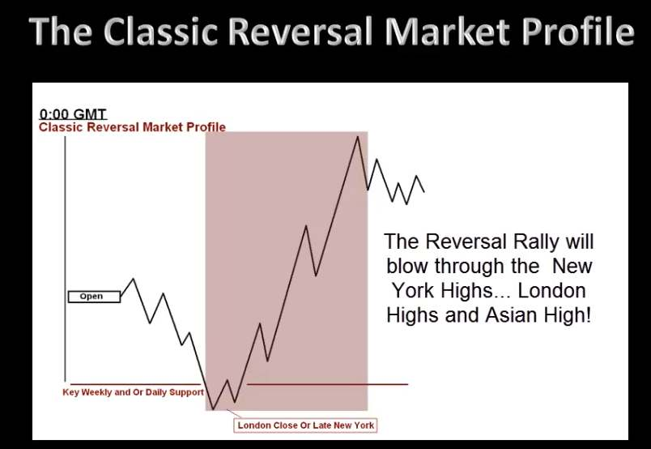 |
| Range to NYO/LC rally | NFP/FOMC pattern: break London lows pre-news, rally after; read the cross pairs | 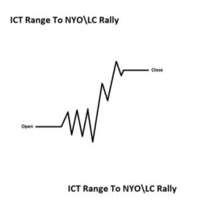 |
| Consolidation raid on news | Consolidate after the open, news spike raids stops below, then true move; reject within 5 min or abandon | 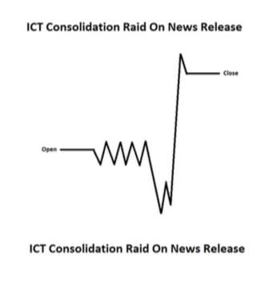 |
| Swing to seek & destroy | Both-side raids after a big move or at the end of a move at S/R | 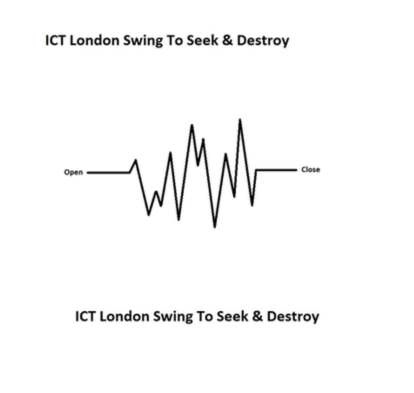 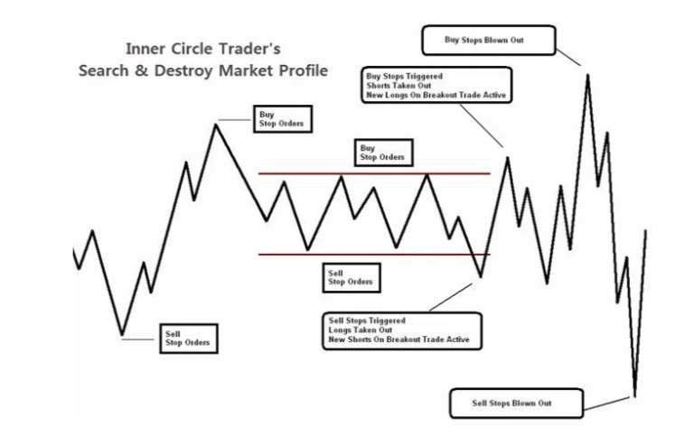 |

Sell templates are the mirror images.

*(News: never guess the number — wait for the release and trade the reaction signal within ~5 minutes. Key
releases per currency listed in the source PDF p. 90.)*

## 16. Ranges

- Markets move from small ranges to large ranges; be positioned during contraction, get paid in expansion.
- Monthly range: fib each internal swing (watch 62–79% zone), re-anchor at every new high/low.
- **5-day ADR**: align trades to it; 5 contracted days → expect expansion; take profit at 80–90% of ADR;
  expect 15:00–16:00 GMT ADR convergence; if exceeded, fib ADR-low→high for extensions.
- **Central Bank Dealers Range (the "flout")**: 20:00–00:00 GMT consolidation (range marked off candle
  *bodies* of 20:00–05:00). Project ±1 standard deviation of the range: high of day ≈ +1 deviation (sell
  days), target ≈ −2 deviations (up to −3). Best Monday–Wednesday. Don't trade 20:00–05:00.

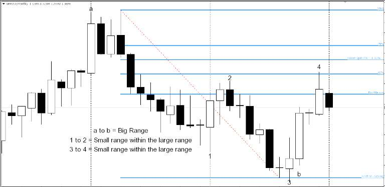

## 17. The Judas Swing

- An engineered false swing that leads reactionary traders the wrong way (named for the Judas goat).
- Forms at: key S/R, previous highs/lows, counter-swing from OTE, raids of previous week/session extremes.
  Trading London → watch Asian stops; NY → London stops; Asia → NY stops.
- Typical times: **10:00 GMT** (sets up NY OTE), **15:00 GMT** (sets up London close trade), 18:00 GMT
  (ignore — past the trading day).

## 18. High-Probability Price Patterns

- **Doji** (neutral, best at swing ends), **Hammer/pin bar** (best H4/H1 at key levels; "Hanging Man" in an
  advance), **Tweezer low/high** (short-term double bottom/top; with SMT divergence = max conviction),
  **Railroad tracks** (engineered reversal; with hammers, the two patterns ICT would keep).
  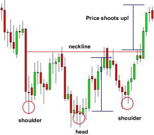
- **Head & shoulders** (neckline-to-head projected from the break; expect a neckline retest),
  **Three Indians / three pushes** with **Wolfe waves** (point 5 false-breaks the 1–3 trendline; target along
  the 1–4 line) — promoted to a concept file: [three-indians](../../knowledge/ict/models/three-indians.md). 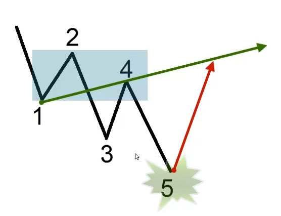 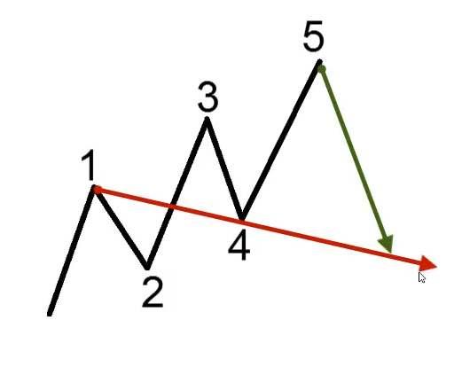
- **Triangles, bull/bear flags, coil expansion**: measured-move projections.
  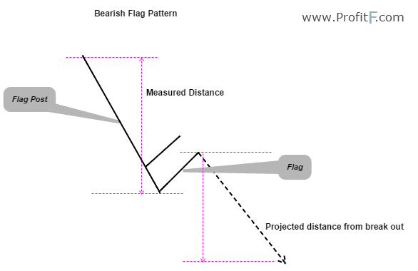 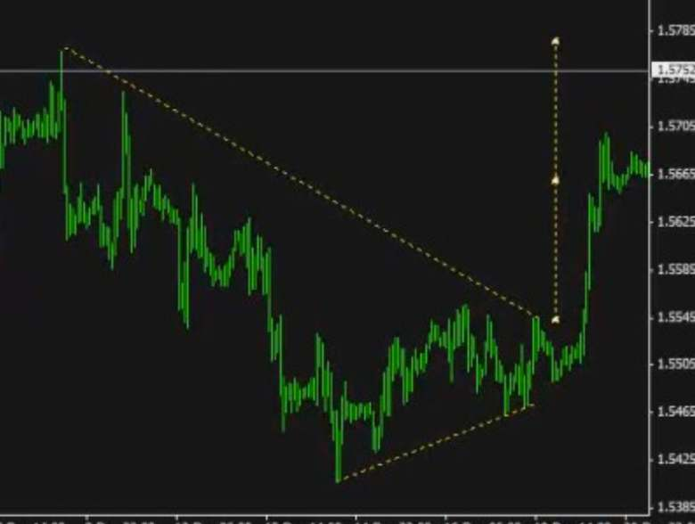
- **Turtle soup**: break of the prior 20-day high/low that snaps back into the range — fade it. LTF version =
  break of any previous high/low (liquidity pool raid). 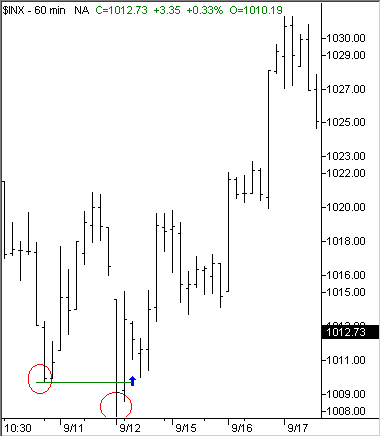
- **Outside day** with down-close at support = bullish (up-close at resistance = bearish);
  **inside day** = contraction → expect expansion with the flow.

## 19. OTE & Order Placement

- **OTE = the 62–79% retracement zone, sweet spot 70.5%** ("roughly the 50% level between 62 and 79").
- Prefer limit orders (best price, control); market orders only to get in sync if the limit missed in London —
  re-enter in NY. Enter between 62% and the sweet spot; 79% is where a deep market might reach.
  Factor spread + 2–3 pips.

## 20. Weekly Highs/Lows & Week Open

- The weekly high or low forms **~80% of the time between Sunday/Monday's open and Tuesday's London open**;
  failing that, between Tuesday's and Wednesday's London opens.
- Keep the weekly opening price marked all week: bullish → buy below it when the weekly low forms.

## 21. Trading-Plan & Psychology Notes (summary)

- No plan = emotion-driven results. Risk ≤2% (1–1.5% for new traders). The entry signal is the *least*
  important component; premise is paramount.
- Take first profit methodically (half off, stop to breakeven). Build goals in pips/week (25 → 50 → 75),
  averaged monthly/quarterly — don't force daily targets.
- 7 keys: know your asset class; think independently; develop and follow a personal plan; impeccable equity
  management; no predictions; think in probabilities.
- Trade like a sniper: fewer, higher-timeframe-aligned trades; D1/H4 for targets, H1/M15 to manage.
